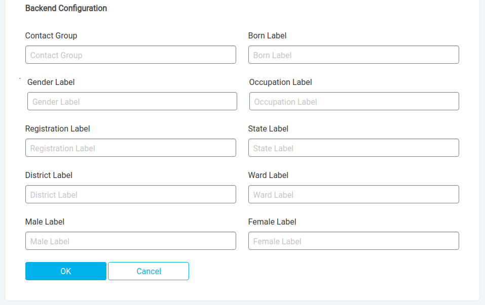

# UNCTs

## List

The homepage of UNCTs' session is a list of all registered UNCTs. Where some actions are available, let's walk through it all.

### Sorting

You can choose to sort by *Name*, *Timezone* or *Language*. The first click will apply alphabetically descending order and the second ascending.

### Search

There's a search bar to find registered UNCTs, you just need to type and press enter. It's case insensitive and capable of searching for strings' fragments at the *name* field.
In the example below the search was *"L"* and it found three UNCTs where the string was found in different spots.  
You can disengage the search filter by clicking the **X** at the right of the bar. //TODO the option isn't available yet.

## Adding a new UNCT

By clicking the **+ UNCT** button the process of registering a new UNCT will start.

> The following steps intends you already have a RapidPro workspace configured and prepared to integrate.

First inputs are relative to platform properties. *Name* and *Language* are free to choose, but *RapidPro URL*, *RapidPro Token* and *Timezone* should match exactly the values from the respective RapidPro workspace.  
Slug is a subdomain that will be used to access the workspace. EG. `sandbox` will create https://*sandbox*.rtm.ilhasoft.mobi <!--Place the final URL when available.-->

*Backend configuration* should be customized with the respective contact settings on RapidPro.  
Fill *Contact group* with the main group name, where registered contacts are. The other fields should be filled with the respective contact field's title for each piece of information:
- *Born Label* for the year of born;
- *Gender Label* for gender;
- *Occupation Label* for the profession (optional);
- *Registration Label* for contact's registration date;
- *State Label* for the first region level, generally State;
- *District Label* for the second region level (optional);
- *Ward Label* for the third region level (optional);

*Male Label* and *Female Label* should be filled with the values that are representing each gender. EG. `Male` and `Female`, respectively.
 

Save clicking **OK** and it will take effect immediately.

## Editing

You can start editing UNCTs just by clicking the pencil icon on its right side. You will have access to all fields.

**CAUTION!!!**  
Pay attention to the field you're editing. Saving incorrect values will make the UNCT workspace become inaccessible and may affect values accuracy.  
Editing *RapidPro Token* or *Backend configuration* values is strongly not recommended and should be done only if oriented by a support member in very specific situations.

## UNCT users

It's possible to edit UNCT's account levels directly from *Global workspace*, just click the group icon on its right side and those UNCT users' list will be loaded.

Then you just have to click at the user's pencil icon and edit its access level, similar to editing on a *Local workspace*.

