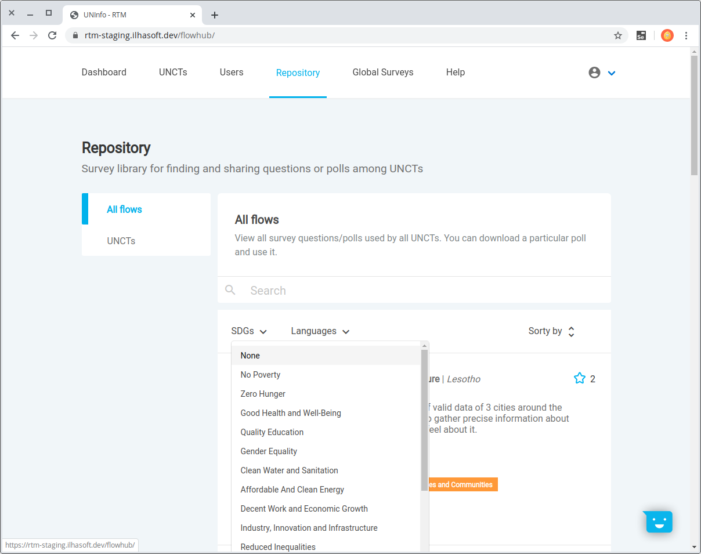

# Flows' repository

The Global RTM Repository module provides access to all shared *survey flows* template files.

> A [RapidPro](https://rapidpro.ilhasoft.mobi) flow is a JSON structured file and you probably won't be able to read it with a regular text editor. A RapidPro administrator has to import that JSON file in the respective UNCT workspace.

## Viewer and Administrator perspectives

In this particular case, features for both account levels are the same, let's walk through each one.

### All flows

This is the Repository's homepage, where all available flows to download are listed.  
It will present the survey title, the UNCT that uploaded it and a short description provided by the administrator who created that flow.

### UNCTs

See a list of all registered UNCTs to sort only its flows and easily download.

## Search

There's a search bar to find surveys, you just need to type and press enter. It's case insensitive and capable of searching for strings' fragments at the survey name or description.  
In the example below the search was *"flow"* and it found five surveys where the string was found in different spots from multiple workspaces.

> You can clear the search anytime just by clicking the **X** button at the right side of the bar.

Besides *survey flows* it's possible to search for UNCTs names. See below a search for "brasil".

## Sorting

It's possible to sort surveys by stars, newest or alphabetically. Clicking the option once will sort ascending and the second time will apply descending.  

You can also filter the list by one specific SDG or language.

> Note that a flow main language may not be the one you're looking for, but there could be a translation for it as one of the flow's secondaries languages.

At the UNCTs session, it's possible to sort by Newest or Alphabetically as well.

## Star score

Given the number of stars of a shared survey may assist you to choose one by popularity.  
The ones you've starred will show a filled star.

## Download

After choosing the survey flow you want, just click **Download** and you'll save the JSON file to your computer.  
There's a download counter for how many hits the button has been clicked.

