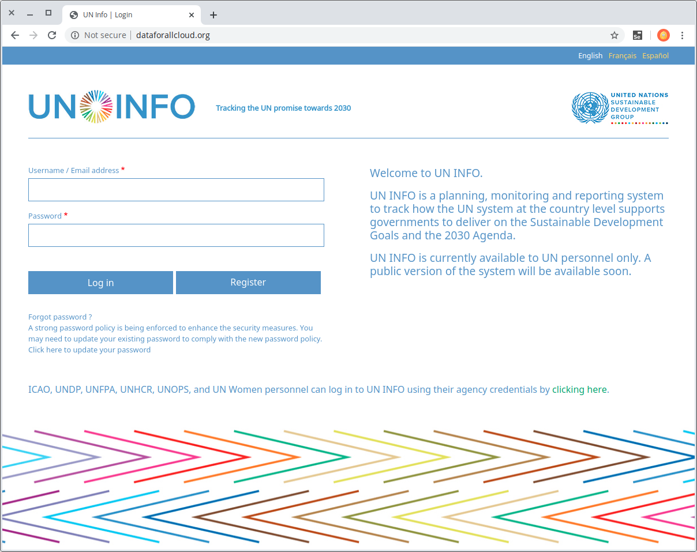
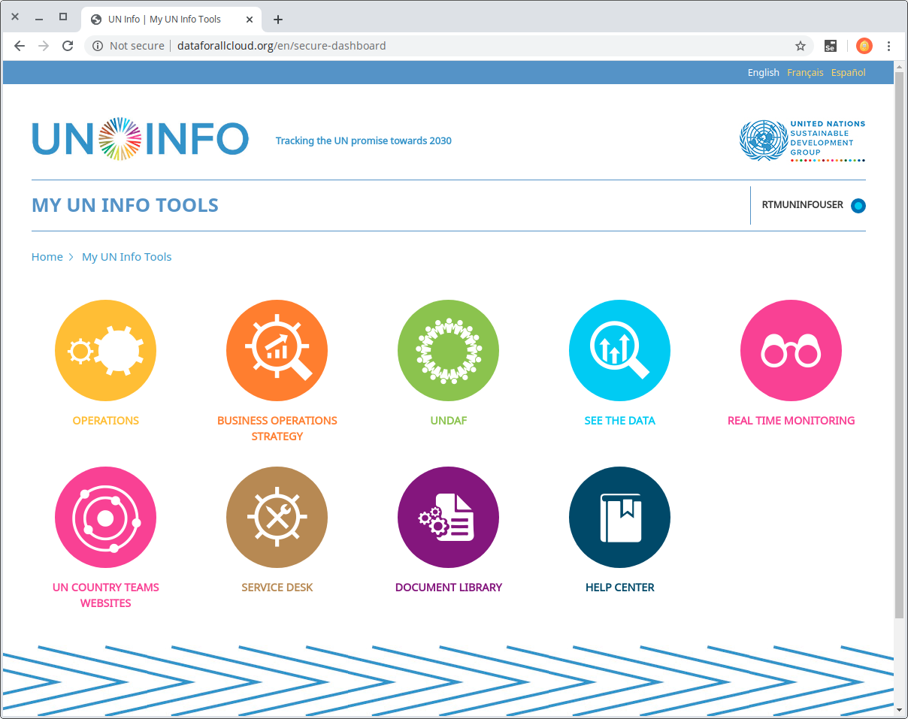
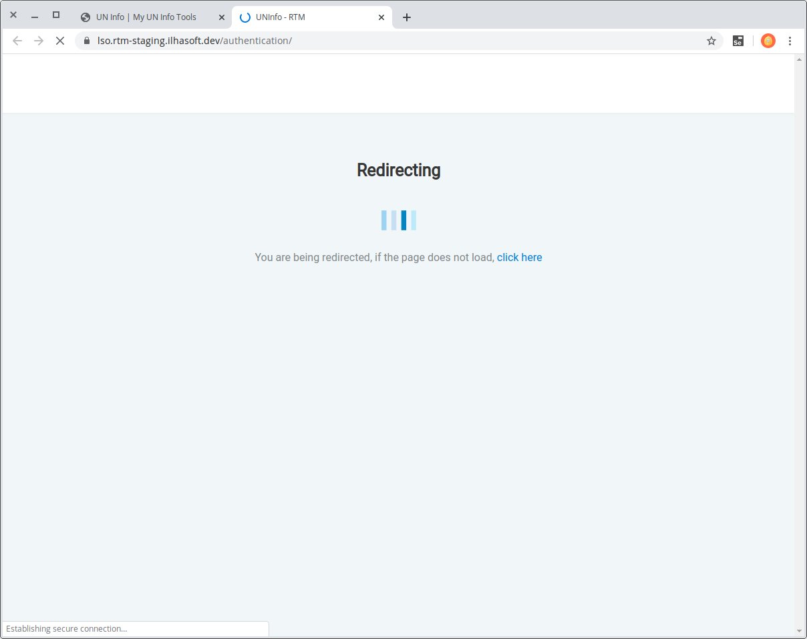
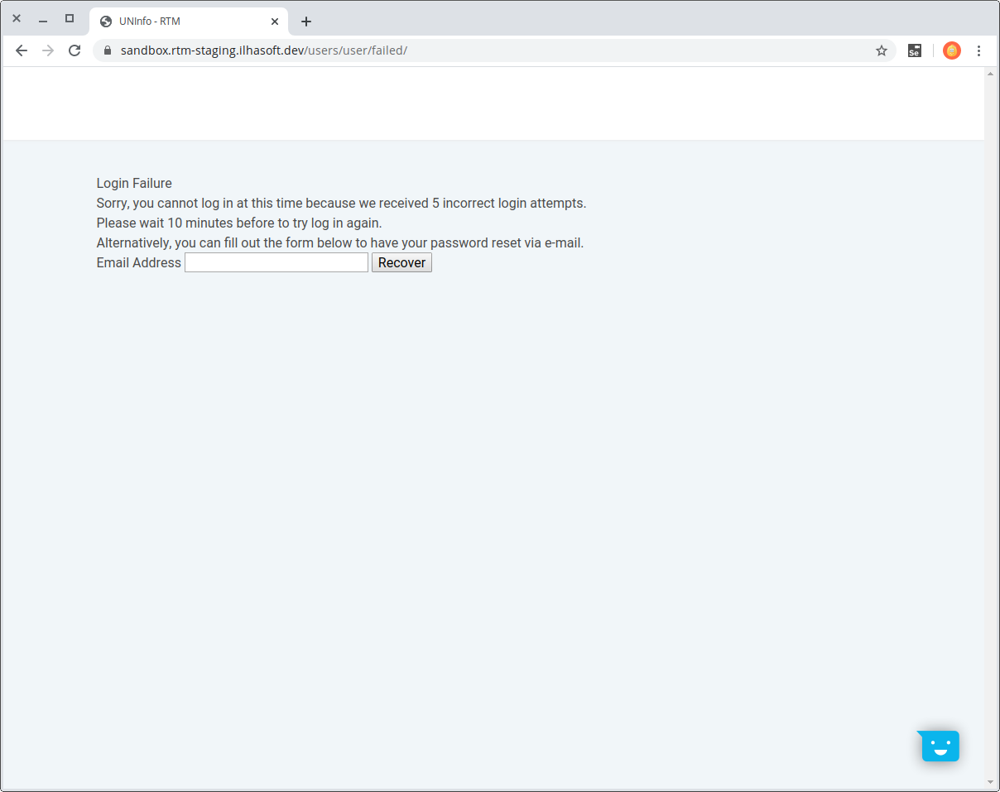

# Login

You may access the RTM platform by entering credentials at [UN Info portal](http://dataforallcloud.org).  
Type you *username*, *password* and hit **Log in**.

> This account is provided by UN team, and you can request yours by clicking _Register_.

Uppon successful login you'll be redirected to UN Info home screen. Now choose **REAL TIME MONITORING** option and click the *UNCT* you want to access.

> The option to access UNCTs' workspaces is managed by UN team.

A redirect window will open to take you to the requested UNCT workspace.  

> On your first login, you'll receive the *viewer* user access permission.

If you fail to login for five consecutive attempts, the account will be blocked for 10 minutes.

