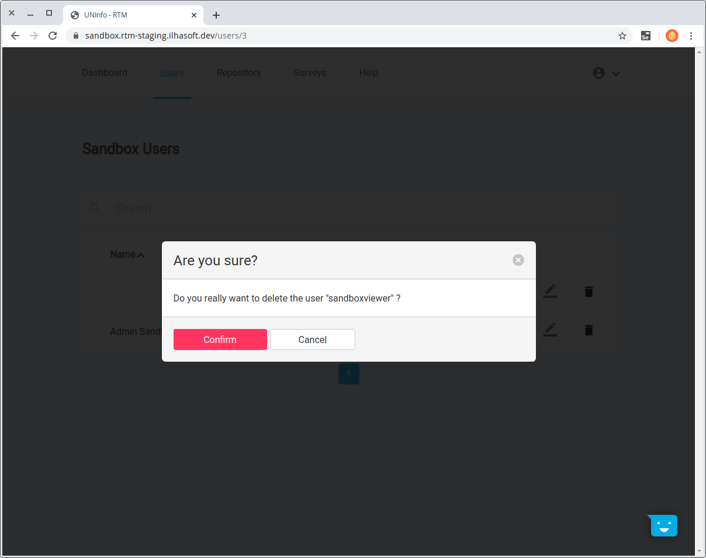

# Users

Account's management area that allows access level control and account removal.  
On your first login, you'll receive *viewer* access permission.  
If you want new user access, a UNCT administrator needs to change your access.

The home page for all logged accounts is the Dashboard.

## Viewer

Allowed to access UNCT's **Dashboard**, **Repository** and **Surveys** a viewer account can only see the data already there.

## Administrator

Administrators' accounts have full access to all tools. Additionally, a user tab is offered to administrate accounts' access level and availability.

### Editing an account

In the image below you can see two sample accounts. As you mouse over the pencil icon it will highlight and clicking will allow editing that account's access level.

Changes take effect immediately but if the modified account is still logging while being edited a fresh login may be needed.

> Note that it isn't possible to edit the account's personal data, if necessary that should be requested directly to a UNCT administrator and the RTM will inherit the info uppon a fresh login.

### Disabling an account

By clicking the trash icon the respective account will be blocked and that login's credentials will be denied.

> A verification box will pop-up for you to confirm. 

### Enabling an account

> To be done! 

// TODO Account enabling feature yet to be developed.