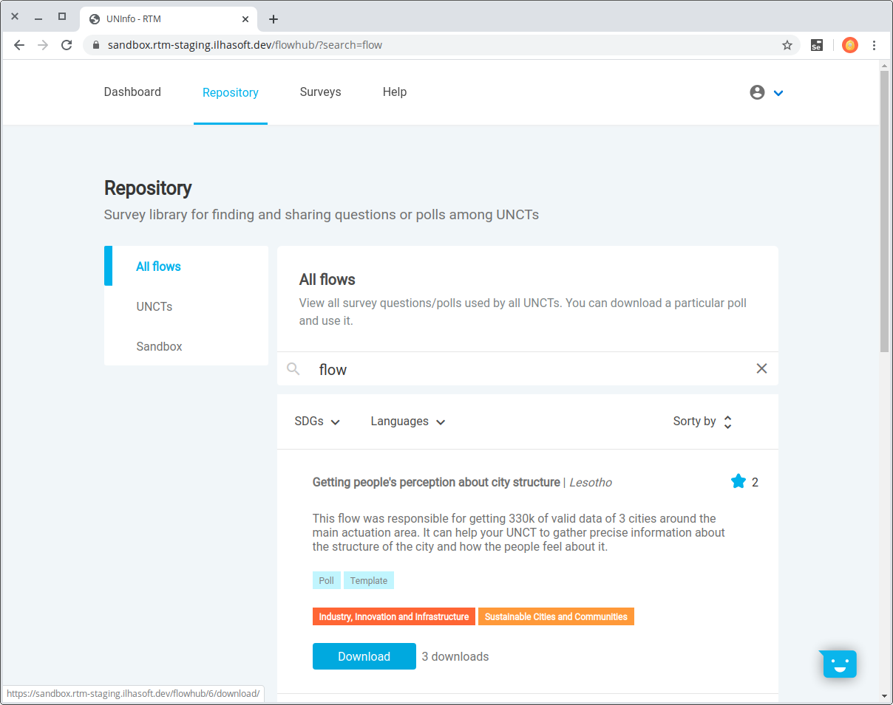

# Flows' repository

The RTM Repository module creates a collaborative ecosystem<!-- gives the opportunity --> to share *survey flows* template files. By sharing surveys, administrators can contribute to more success cases' with UNCTs aiming the same goal.  
[RapidPro](https://rapidpro.ilhasoft.mobi) is the platform that empowers social programmes within the necessary environment for collecting communities' thoughts and its core resides in *Flow* feature.

> A flow is a JSON structured file and you probably won't be able to read it with a regular text editor. A RapidPro administrator has to import that JSON file in the respective UNCT workspace.

## How to share

Only administrators can add new flow files, and it's possible to choose to share it restricted to the UNCT you're in or globally.

## Viewer perspective

A viewer has access to all but adding new files to share.

### All flows

This is the Repository's homepage, where all available flows to download are listed.  
It will present the survey title, the UNCT that uploaded it and a short description provided by the administrator who created that flow.

### UNCTs

See a list of all registered UNCTs to sort only its flows and easily download.

### My UNCT

Restricts the list for your UNCT's flows only.

## Administrator perspective

An administrator has access to all features, including surveys' actions for adding new, removing and editing.

### Upload Flow

Share flows from RapidPro on RTM is a simple process. On the side menu, you have the option Upload Flows which leads the user to a form where the survey (flow) can be registered.

## Search

There's a search bar to find surveys, you just need to type and press enter. It's case insensitive and capable of searching for strings' fragments at the survey name or description.  
In the example below the search was *"flow"* and it found three surveys where the string was found in different spots.

## Sorting

It's possible to sort surveys by stars, newest or alphabetically. Clicking the option once will sort ascending and the second time will apply descending.  

You can also filter the list by one specific SDG or language.

> Note that a flow main language may not be the one you're looking for, but there could be a translation for it as one of the flow's secondaries languages.

At the UNCTs session, it's possible to sort by Newest or Alphabetically as well.

## Star score

Given the number of stars of a shared survey may assist you to choose one by popularity.  
The ones you've starred will show a filled star.

## Download

After choosing the survey flow you want, just click **Download** and you'll save the JSON file to your computer.  
There's a download counter for how many hits the button has been clicked.

