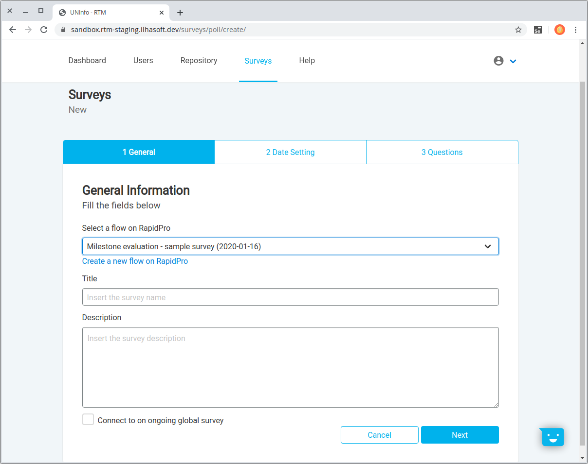
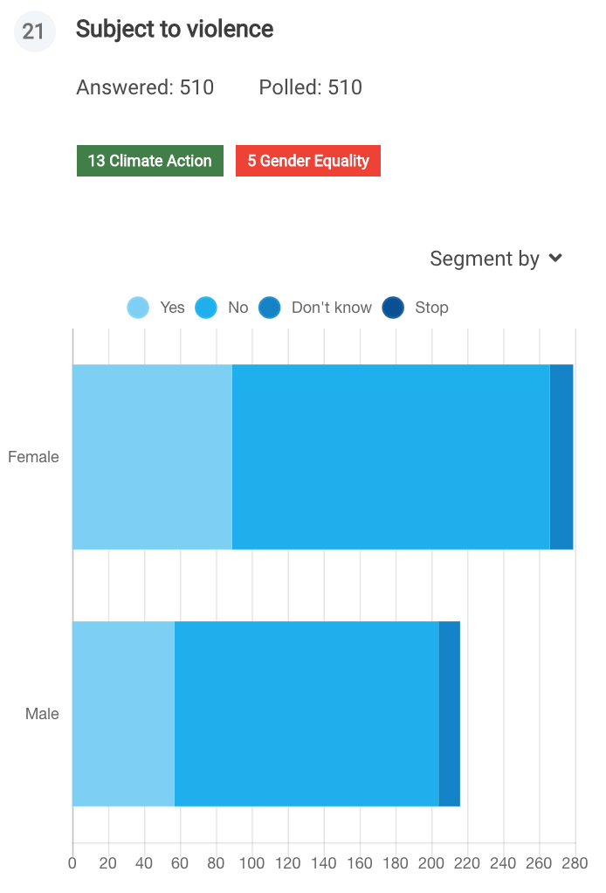
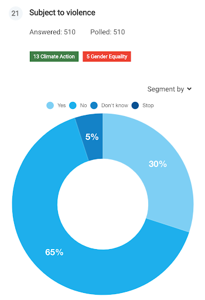
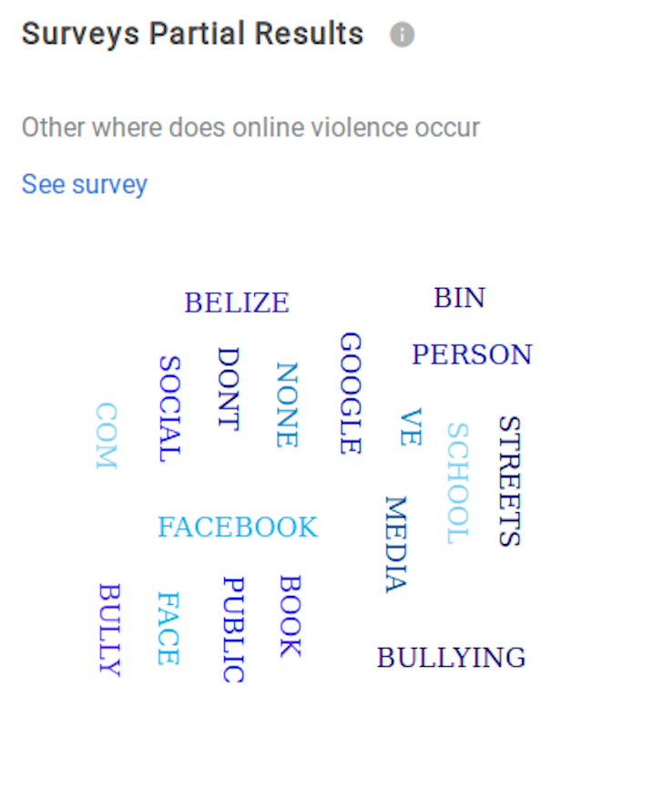

# Surveys

The survey results module displays citizen-generated data from answers of ongoing or already finished surveys.  
It represents a flow from RapidPro which was linked to the RTM platform and has synchronized data.

Navigating through surveys can be done using the top bar and also with the bread crumbs (right above the page's title) as you go further in options.

In the next steps we'll cover everything in order to engage a fully working survey content within all its features.  
<!--Let's dig a little deeper.-->

## Viewer perspective

As *viewer*, an account may access all *Surveys* data but no editing allowed.

## Administrator perspective

An *administrator* account will also be capable of add, edit or exclude content.

### Connecting a Survey

Connecting a Survey is basically the process of linking flows from a RapidPro UNCT workspace into the RTM platform and customizing its layout to better suit the RTM graphs and dashboards.  
The first thing you need to do is clicking the *Connect Survey* button on the right side. There are three major steps in the survey registration process, let's walk through each one.

### Survey General info

The first step is selecting which RapidPro flow will be the source of this survey.

> These actions pretends that you have already finished creating the survey flow within all its steps and requirements. **No RapidPro flow editing should be done at this point if contacts already replied to it or you will lose previous answers!

*Title* should be filled with the survey name that will be displayed, so you may describe it better than just the flow's name.  
*Description* is where you can highlight in which case has this survey been taking place and describe its goals.

Than hit *Next* to move forward.

#### Connect to a Global survey

Note there's a check-box to link this survey to an ongoing *Global survey*.

<!--Global Survey environment description-->

### Date setting

Set a date range is optional but is also an important step. You can leave the default *Start date*, which is that date the RapidPro flow was created, but it also corresponds to the time when the survey was published live for the community.  
Filling the *end date* field will set when the survey got unpublished, it means that the results will be shown on the time interval between these two dates.

### Questions

The survey structure that comes from RapidPro is raw, it must be customized in order to better display it at the *Surveys results*.  
It is defined by the administrator when choosing the respective question title, SDG and visibility.

> Note that the *Categories* from a RapidPro flow's *Wait for response* are the matching answers at each question. So you need to categorize RapidPro flow's steps carefully.

#### Identifying the question

You'll see a numbered title for each question available. That title matches the *Wait for response* named variable. In the example **Result 1** goes for the first flow question step from RapidPro.

> RapidPro limits variable names characters, but note that default values aren't the best case either. So the more specific you place a variable name in RapidPro flow's the easier will be its association.

#### Question's title

Here you may feel more comfortable to provide a larger question description and highlight different perspectives to encourage positive discussion.  
The default value will be the respective question step from the RapidPro flow.

#### Question's SDGs

Link which SDG is being tracked in this question. More than one can be selected if that's the case.

#### Question's visibility

RapidPro flow's questions aren't necessarily connected to the purpose of a survey, and if that's the case you can disable that step. This means that question won't be visible in the *Survey Results* session.

#### Publish the survey's results

After filling all necessary fields, you just need to save and those survey results will become accessible at the *Surveys Results* session.

## Search

There's a search bar to find surveys, you just need to type and press enter. It's case insensitive and capable of searching for strings' fragments at the name of active or inactive surveys.
In the example below the search was *"a"* and it found five surveys where the string was found in different spots.  
You can disengage the search filter by clicking the **X** at the right of the bar.

## Sorting

It's possible to sort surveys by *Name*, number of *Runs* and *Status*. Clicking the option once will sort ascending and the second time will apply descending.  

Sorting can be a very useful tool as your survey's list grow bigger, in the example below there's a search for *"a"* and it's also sorting the list by *Name*.

## Editing

When needed to have a survey modified, you can choose between two ways.

### Full survey editing

Clicking the pencil icon on the right side of the surveys' list will open a window similar to the one when you were adding a new survey.

But you'll be editing it. And the only unavailable option is the flow link.

> If needed to change the flow you should disable this survey and create a new one.

You can freely modify the *Title* and *Description*. Note there's also a new option now *Is active*, where you can set if this hole survey should be visible or not.  
Clicking next will move forward to each step until you finish editing.
 

### Directly questions

By clicking the question's number you'll be taken directly to questions' editing.

## Disabled Surveys

A grayed survey line means that it has been disabled and become inaccessible. A disabled survey won't have its results synchronized.  
In most cases disabling a survey means that result is no longer necessary or something went wrong with it.

## Surveys' results

Here, you will find all surveys that were registered on your UNCT. Survey results can be analyzed by selecting a survey on the survey's list.

When choosing a survey on the list you will be redirected to the survey results page, which displays all details and charts. It's also possible to use the left panel and filter by SDG displaying only the questions that match the ones selected.

### Question's segments

If you need to restrict the scope of one question, by *Gender* or *Age*, there's an option to do it at each question graph. Choosing *All* will clear the restriction and display the full question's result.

### Charts and Answer Types

To get a clear view of each survey results we've plan to describe all questions and its answers in the following kinds of charts:

**Horizontal Bars**  
Are used to display in a more simple and absolute approach.

*Consolidation type:* Age, Gender

**Doughnut**  
Doughnut charts are going to be used to compare answers between results and percentages.

*Consolidation type:* Age, Gender

**Word cloud**  
Chart that allows users to overview open questions, this kind of chart is going to be good to compare the most commonly answered words.

