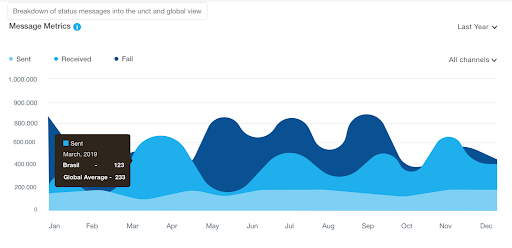
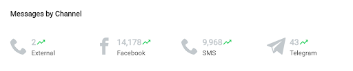

# Dashboard

This is the main session of the platform and also its homepage. It's here where all the survey's data gathered will be available for analysis.  
Like a main access point, it allows gathering different perceptions from ongoing surveys and useful RapidPro data metrics.

> As all content here is read-only, *Administrator* and *Viewer* have the same features available.

## Walkthrough

The page's title is the *UNCT workspace name* and right below it's the scope of the first *Filter*.

To ease the understanding, there's a block division for each data type.  
The first one is related to *SDGs tracking*, then *Surveys Partial Results*, *Message Metrics*, *Most used Channels* and lastly *RapidPro Contacts*.  
Each one has its own features and sorting options and we'll go through it all on the topics below.

This is how an empty workspace looks like.  

### SDGs Tracking

In the bubble graph, you can see which SDG is being more tracked related to others.  
In other words, it shows the number of received messages from questions that are linked to the respective SDG.

There are two separate sections to display the SDGs tracking status. The order doesn't interfere with the bubble size, it is ordered by crescent numerical order.  
To provide better readability there is a tooltip on each bubble displaying the SDG name and also the received messages count.

### Surveys Partial Results

To follow ongoing surveys and track how the answers are being structured as it comes from RapidPro, the partial results graph randomizes 20 questions to be displayed.  
It will bring a more close approach to ongoing surveys.

#### Sorting and Filtering

There is a filter by SDG on the upper right corner, it allows to list questions that are linked to the selected SDG.  
By navigating through the questions you will get indicators from ongoing answers to each question.

### Message Metrics

RapidPro registers message traffic information. This information reflects the ongoing and finished survey's level of engagement.  
This dashboard module shows the sum of aggregated values from messages sent and received.

There's also a tracking statistics by active channels on the UNCT's RapidPro workspace.

The message metrics by channel board displays the sum of all sent and received messages for a general overview of all channels and its usage status.

### RapidPro Contacts

The number of contacts is a very important piece of information provided by RapidPro. It means the number of contacts inside the registered group and can be used to show the workspace's contact level of growth. The graph allows for seeing this information from the last 6 months.

> The second graph (right side) shows the number of contacts from the user UNCT against the global average.

