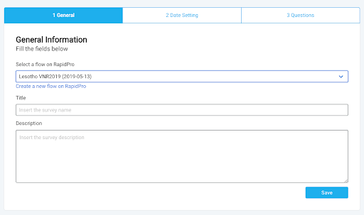
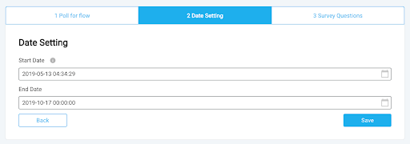
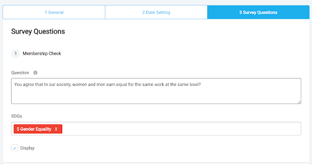
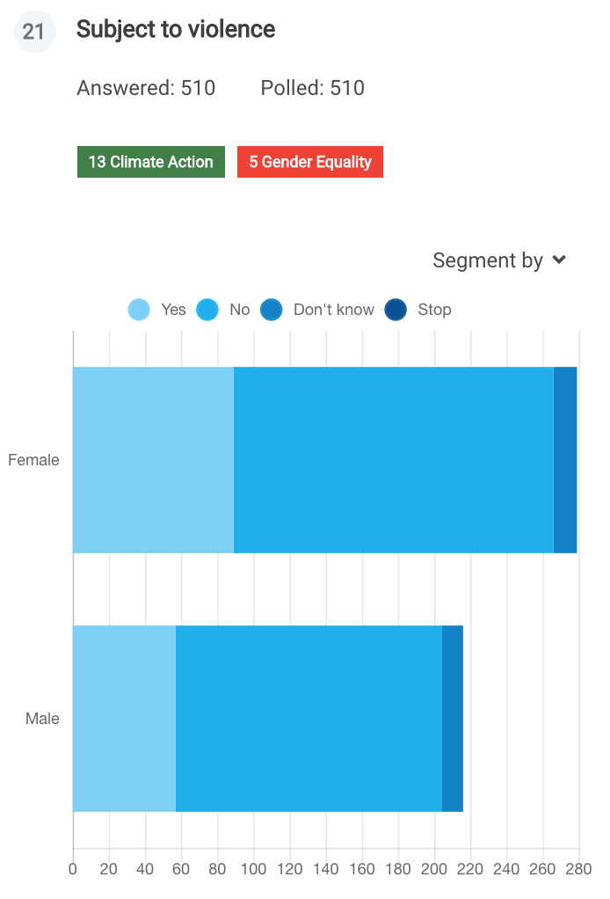
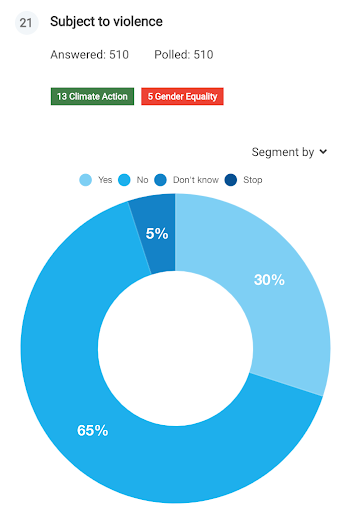
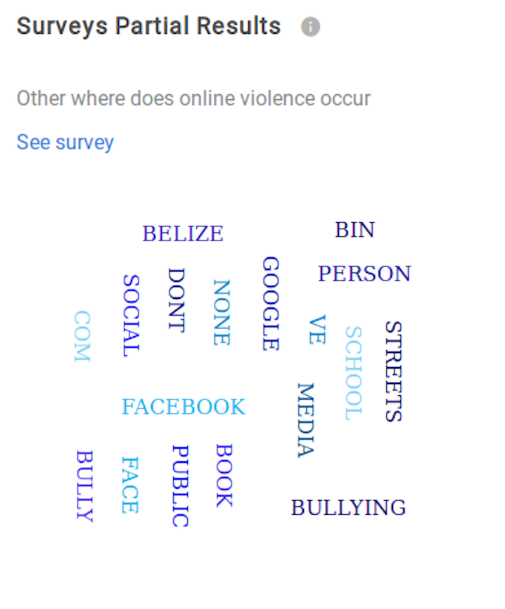
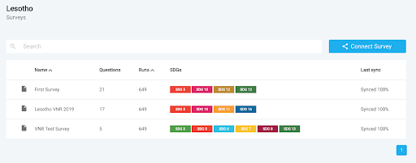
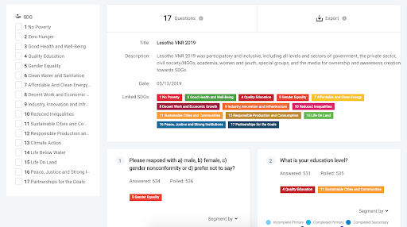
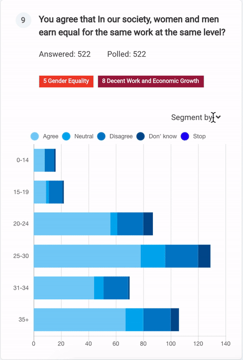

==============
Survey Results
==============
| The survey results module displays citizen-generated data from answers of ongoing or already finished surveys.
| It represents a flow from RapidPro which was linked on RTM and has the data synchronized.

Survey Register and Structure
-----------------------------
| The survey register process is basically the process of linking the RapidPro flow inside the RTM platform and customizing it to be better displayed on RTM graphs and dashboards.
| There are 3 steps on the survey registration process:

* Survey details
* Date setting
* Survey questions setup

Survey Details
^^^^^^^^^^^^^^
| To register a survey is necessary to fill all the basic information, such as title, description, start date, and end date.
| Besides this information, it's necessary to link the RapidPro flow that corresponds to your survey that is being registered on RTM as described in the image below.

Survey Date Settings
^^^^^^^^^^^^^^^^^^^^
| Another important step in the survey register process is to set up the initial and finish date.
| The initial date corresponds to the time when the survey was published live for the population.
| The final date is an optional field to set when the survey got unpublished, it means that the results will be shown on the time interval between these two dates.

Survey Questions
^^^^^^^^^^^^^^^^
| The survey structure that comes from RapidPro is raw, it must be customized in order to better display it on the surveys results graphs.
| It is defined by the user when choosing the respective question title, SDG and visibility.

The SDG link is the most important feature when linking RapidPro surveys on RTM, it defines which tracks individuals SDGs, so when dealing with dashboards and results' graphs, the user will see answers that directly impact on respective SDGs.

Charts and Answer Types
-----------------------
To get a clear view of each survey results we've plan to describe all questions and its answers in the following kinds of charts:

**Horizontal Bars**
Are used to display in a more simple and absolute approach.

**Consolidation type**: Age, Gender

**Doughnut**

Doughnut charts are going to be used to compare answers between results and percentages.

**Consolidation type**: Age, Gender

**Word cloud**
Chart that allows users to overview open questions, this kind of chart is going to be good to compare the most commonly answered words.

Data Analysis
-------------
Survey results can be analyzed by selecting a survey on the survey's list.

| Here, you will find all surveys that were registered on your UNCT, it is also possible to search by name and order by runs count.
| When choosing a survey on the list you will be redirected to the survey results page, which displays all details and charts.

There you can see a side menu where the user can filter by SG, the survey title, description, how many questions the survey has, which SDG is being tracked and the export as JSON option.

When dealing with charts, you can choose to segment data by gender or age. It will impact on the visualization and the chart will change to better display the data.

